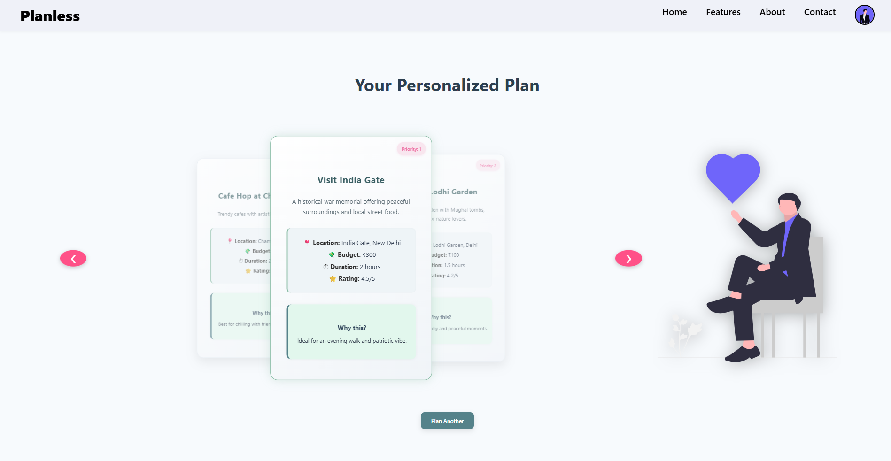

# 🌟 Planless – Make Every Hour Count

**Planless** is a smart, mood-based activity planning assistant that helps you find the perfect thing to do based on your **mood**, **budget**, and **time**—whether you’re flying solo or planning with friends. It delivers personalized, real-time suggestions that make every moment meaningful.



---

## ❓ Why Planless

### Imagine this:

You're visiting a new city—maybe on vacation, a college trip, a solo getaway, or just tagging along with relatives.  
You’ve got a few hours free, some money to spend, and the desire to do *something* enjoyable...  
But here’s the problem:

- You **don’t know the area** well  
- You’re **unsure what fits your current mood**—maybe you're in the mood to explore, relax, eat, or just vibe somewhere calm  
- You’re **not sure what fits your budget**  
- You're either **alone**, with a **friend group**, **family**, or even a **workmate**

That’s where **Planless** steps in.  
Just tell us how you feel, how much time you’ve got, and your budget range—we’ll do the rest.

---

### 💡 With Planless, you get:

✅ Smart suggestions based on your **mood, time, budget, and location**  
✅ Experiences tailored for **solo, group, or family settings**  
✅ Real-time options using **Google Places** and **Gemini AI**  
✅ An end to decision fatigue—**just pick and go**

No more Googling for hours, no more wasting time deciding.  
**Planless turns any place into your place**—instantly.

---

## 🚀 Features

- 🎯 **Personalized Plans** – Get recommendations tailored to your mood, budget, and time availability.
- 💰 **Budget-Friendly** – From free activities to premium experiences, we curate options that suit your wallet.
- 🕒 **Time-Based Suggestions** – Have 15 minutes or a full day? Planless gives the best options for any schedule.
- 🤝 **Solo or Social** – Whether you're alone or with a group, get suggestions that adapt to your company.
- 📍 **Location Aware** – Discover real-time, nearby events and activities.

---

## 🛠️ Tech Stack

| Frontend        | Backend          | Others                |
|-----------------|------------------|------------------------|
| React.js / HTML-CSS | Node.js / Express | Google places API, Google Gemini API, |

---

## 📦 Installation

Step-1 Clone the Repository

```bash
git clone https://github.com/prasumdubey/AI-planner.git

```

Step-2 Install Dependencies

```bash
cd ai-planner
npm install

```

Step-3 . Get Your API Keys
1. 🔑 Google Places API
2. Go to the Google Cloud Console
3. Create a new project or select an existing one.
4. Enable Places API.
5. Navigate to APIs & Services > Credentials, and generate an API Key.
6. Restrict it for web or server-side use as needed.
7. 🤖 Google Gemini API (for AI-powered suggestions)
8. Visit Google AI Studio
9. Create a project and generate your Gemini API Key.

Step-4 Set Up Environment Variables
Create .env file in the ai-planner/server directory and add:

```bash 
GOOGLE_PLACES_API_KEY=your_google_places_api_key
GEMINI_API_KEY=your_gemini_api_key

```

step-5 Start Development servers

```bash
#(In current terminal  --  Frontend)
npm run dev 

#(In another terminal --  Backend)
cd ai-planner/server
node index.js

#click on the link on 1st terminal(Frontend Server)
```
